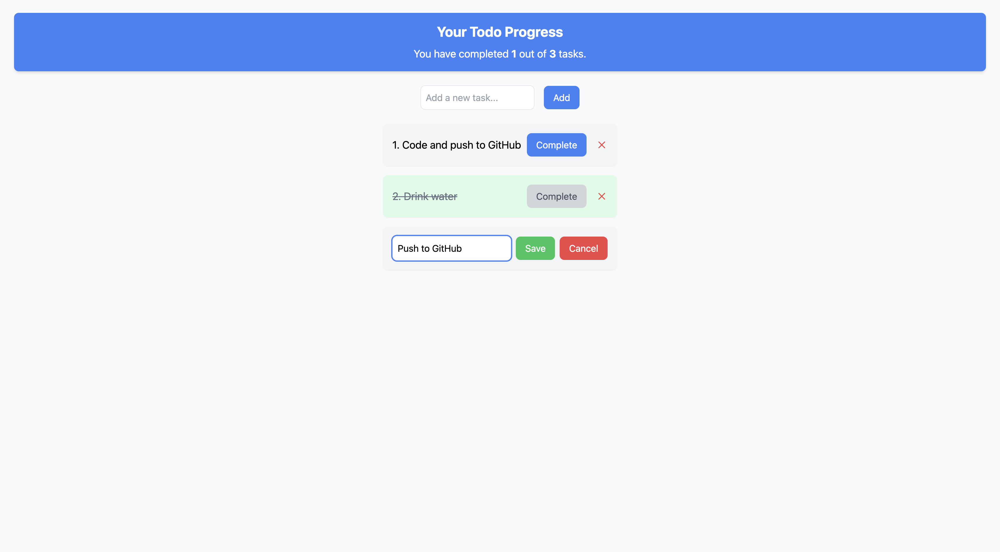

# Todo App

A simple and interactive Todo App built with **React.js** and **Tailwind CSS**, allowing users to create, edit, complete, and delete tasks. The app dynamically updates the number of completed and total tasks, providing a clean and user-friendly interface.



---

## Features
1. **Add Tasks**:
   - Users can add new tasks by entering text in the input field and clicking the "Add" button.

2. **Edit Tasks**:
   - Click on the text of a task to edit it. Once in edit mode, users can save their changes or cancel the edit.

3. **Complete Tasks**:
   - Click the "Complete" button to mark a task as completed. Completed tasks are styled with a strikethrough and green background.

4. **Delete Tasks**:
   - The "X" button on the far right of each task allows users to delete tasks.

5. **Dynamic Progress**:
   - The app displays real-time progress, showing the number of completed tasks out of the total tasks.

6. **Responsive Design**:
   - The app is designed to look good on any screen size.

---

## How It Works

1. **State Management**:
   - The app uses React’s `useState` to manage tasks, editing states, and completion status dynamically.

2. **Components**:
   - **TODOHero**: Displays progress (completed vs. total tasks).
   - **TODOForm**: Allows users to input and add new tasks.
   - **TODOList**: Renders all tasks with functionality to edit, complete, and delete them.

3. **Interactivity**:
   - Tasks are displayed in a list, with buttons for editing, completing, and deleting.
   - Tasks are styled conditionally based on their completion status.

---

## How to Run Locally

1. Clone the repository:
   ```bash
   git clone https://github.com/yourusername/todo-app.git